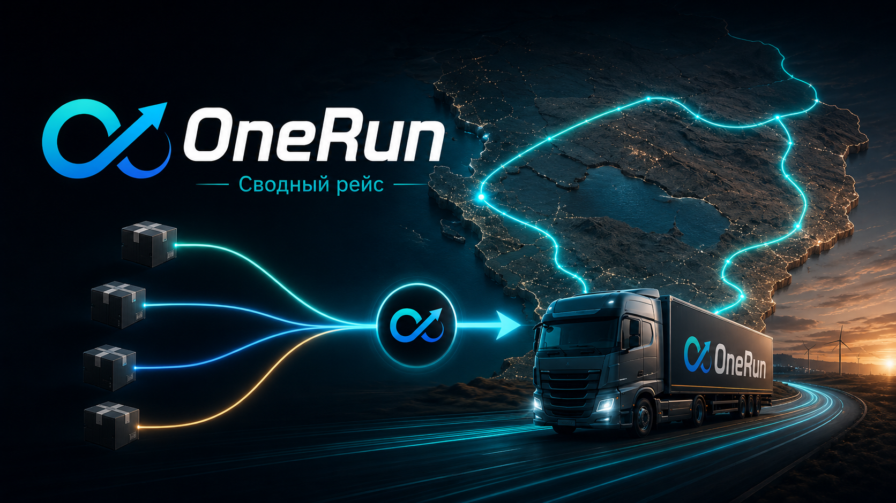
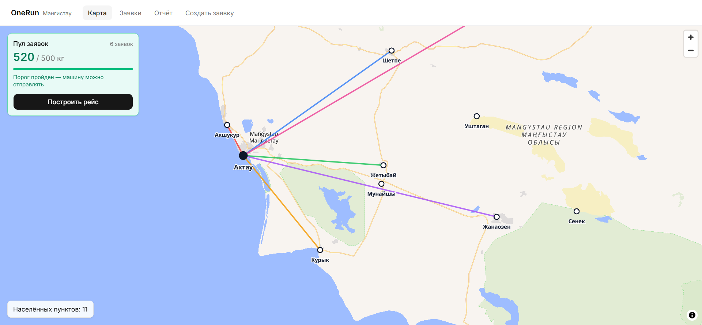
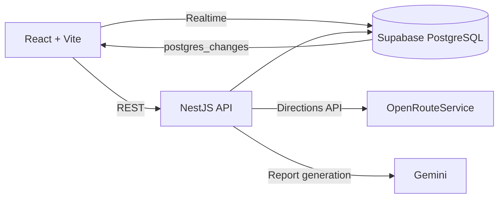

<p align="center">
  
</p>

<h1 align="center">OneRun — Сводный рейс</h1>

<p align="center">
  <strong>Платформа, которая объединяет небольшие заявки на перевозку по Мангистау в один общий рейс — с готовым маршрутом, распределением стоимости и планом погрузки.</strong>
</p>

<p align="center">
  
  
  
  
  
  
</p>

<p align="center">
  <a href="https://pure-perception-production-173c.up.railway.app/landing">
    🚀 Live Demo
  </a>
  ·
  <a href="https://www.google.com">
    📊 Presentation
  </a>
  ·
  <a href="docs/">
    📚 Documentation
  </a>
</p>

---

<p align="center">
  
</p>

---

## Что такое OneRun? 🚚

**OneRun** решает простую, но дорогую проблему региональной логистики: небольшие грузы часто не набирают целую машину.

Если одному магазину нужно отправить 80 кг, стройке — 200 кг, а фермеру — ещё 150 кг, отдельный рейс для каждого становится экономически невыгодным.

OneRun собирает такие заявки в общий пул и превращает их в **один сводный рейс**.

> Несколько небольших отправлений → одна загруженная машина → один маршрут → каждый платит только свою долю.

---

## Проблема 🔍

В отдалённых населённых пунктах Мангистау мелкие партии часто перевозятся неэффективно:

* отдельная заявка не окупает полноценный рейс;
* заявки находятся в звонках и WhatsApp-группах;
* логист сводит грузы вручную «на глаз»;
* несколько машин проходят похожие расстояния независимо друг от друга;
* отправитель фактически переплачивает за недозагруженный транспорт.

В результате перевозчик теряет загрузку и километры, а клиент — деньги и время.

---

## Решение ✅

OneRun объединяет заявки в единую систему:

```text
Небольшие заявки
      ↓
Общий пул грузов
      ↓
Достижение порога загрузки
      ↓
Построение одного сводного маршрута
      ↓
Расчёт стоимости для каждой заявки
      ↓
План погрузки + отчёт для логиста
```

Логист видит заявки на карте, контролирует суммарный вес пула и запускает формирование рейса только тогда, когда машина достаточно загружена.

---

## Как выглядит demo flow? 🎬

```text
1. На карте Мангистау появляется пустой пул
2. Демо-панель последовательно создаёт заявки
3. Каждая заявка появляется на карте в реальном времени
4. Суммарный вес достигает порога 500 кг
5. Становится доступно построение рейса
6. OneRun определяет порядок объезда
7. OpenRouteService строит маршрут по дорогам
8. Backend рассчитывает стоимость каждой заявки
9. Формируется план погрузки по принципу LIFO
10. Отчёт показывает маршрут, цены и экономический эффект
```

---

## Экономический эффект 📉

В демонстрационном сценарии OneRun показывает разницу между несколькими отдельными рейсами и одним сводным:

| Показатель           |       Результат |
| -------------------- | --------------: |
| Отдельные рейсы      |     **1940 км** |
| Сводный рейс         |      **812 км** |
| Сэкономленный пробег |     **1128 км** |
| Расчётная экономия   | **≈ 201 000 ₸** |

> Это результат демонстрационного сценария MVP, а не универсальная гарантия для любого маршрута.

Стоимость сводного рейса распределяется между отправителями с учётом веса груза и расстояния до точки назначения.

---

## Основные возможности ✨

* 🗺 **Карта Мангистау** — реальные населённые пункты и визуализация заявок;
* ⚡ **Realtime-заявки** — новые грузы появляются без перезагрузки страницы;
* ⚖️ **Общий пул** — система считает суммарный вес и момент готовности машины;
* 🛣 **Маршрут по дорогам** — OpenRouteService возвращает геометрию и километраж рейса;
* 💰 **Распределение стоимости** — каждая заявка получает рассчитанную долю;
* 📦 **План погрузки LIFO** — первая выгрузка располагается ближе к выходу;
* 🤖 **AI-отчёт** — Gemini формирует понятный отчёт для водителя и логиста;
* 🧯 **Fallback-режим** — сбой внешнего LLM не должен ломать демонстрацию;
* 📋 **Список заявок** — маршрут, груз, вес, статус и рассчитанная стоимость в одном месте;
* 🎛 **Демо-панель** — управляемый сценарий для повторяемого показа проекта.

---

## Архитектура 🧩



### Основной поток

```text
Пользователь / демо-панель
          ↓
      React frontend
          ↓ REST
       NestJS API
       ↙   ↓    ↘
Supabase   ORS   Gemini
   ↓       ↓       ↓
 заявки  маршрут  отчёт
       \    |    /
        готовый рейс
```

### Технологии

| Слой         | Технологии                                          |
| ------------ | --------------------------------------------------- |
| Frontend     | React 19, Vite, TypeScript, Tailwind CSS, shadcn/ui |
| Navigation   | React Router                                        |
| Server state | TanStack Query                                      |
| Map          | MapLibre GL JS                                      |
| Backend      | NestJS, TypeScript                                  |
| Database     | Supabase / PostgreSQL                               |
| Realtime     | Supabase Realtime                                   |
| Routing      | OpenRouteService                                    |
| AI report    | Gemini                                              |
| Deployment   | Railway                                             |

---

## Логика расчёта 💰

### Порог пула

Рейс можно формировать после достижения:

```text
500 кг
```

### Базовая стоимость километра

```text
25 л / 100 км × 340 ₸ × 2.1 ≈ 178.5 ₸ / км
```

### Доля отправителя

Стоимость распределяется пропорционально тонна-километрам:

```text
tkm_i   = weight_i / 1000 × distance_i
share_i = tkm_i / Σ tkm
price_i = total_route_cost × share_i
```

Так тяжёлый груз в дальний населённый пункт получает большую долю стоимости, чем лёгкий груз на коротком плече.

---

## Быстрый запуск 🚀

### Требования

Для полного локального запуска понадобятся:

* Git;
* Node.js и npm;
* Supabase project;
* OpenRouteService API key;
* Gemini API key — только если нужен реальный AI-отчёт.

> Frontend умеет работать и на локальных fixtures: значение `VITE_API_BASE_URL=/mock` включает mock-режим без backend.

### 1. Клонирование

```bash
git clone https://github.com/kiratonine/OneRun.git
cd OneRun
```

### 2. Backend

```bash
cd backend
npm ci
cp .env.example .env
```

Заполните `backend/.env`:

```env
PORT=3000
CORS_ORIGINS=http://localhost:5173

SUPABASE_URL=
SUPABASE_SERVICE_ROLE_KEY=

ORS_API_KEY=

LLM_PROVIDER=mock
GEMINI_API_KEY=
GEMINI_MODEL=gemini-3.1-flash-lite
```

### 3. База данных

Создайте Supabase project и примените SQL-файлы в следующем порядке:

```text
backend/supabase/migrations/0001_initial_schema.sql
backend/supabase/migrations/0002_persist_trip.sql
backend/supabase/seed.sql
```

### 4. Frontend

```bash
cd ../frontend
npm ci
cp .env.example .env
```

Для работы с локальным backend:

```env
VITE_API_BASE_URL=http://localhost:3000/api

VITE_SUPABASE_URL=
VITE_SUPABASE_ANON_KEY=
```

Если Supabase Realtime не настроен, приложение может использовать резервный механизм обновления данных.

### 5. Запуск

Терминал 1:

```bash
cd backend
npm run start:dev
```

Терминал 2:

```bash
cd frontend
npm run dev
```

Откройте:

```text
Frontend: http://localhost:5173
Backend:  http://localhost:3000/api
Health:   http://localhost:3000/api/health
Landing:  http://localhost:5173/landing
```

---

## Проверка проекта 🧪

### Backend

```bash
cd backend
npm test
npm run typecheck
npm run build
```

### Frontend

```bash
cd frontend
npm run typecheck
npm run lint
npm run build
```

Перед демонстрацией также рекомендуется вручную проверить полный сценарий формирования рейса.

---

## Структура репозитория 📁

```text
OneRun/
├── assets/
│   ├── logo/
│   │   └── onerun-logo.png
│   └── screenshots/
│       └── onerun-dashboard.png
├── backend/                    # NestJS API, routing, pricing, reports
│   ├── src/
│   └── supabase/               # Schema migrations and seed
├── frontend/                   # React/Vite web application
│   └── src/
├── context/
│   ├── TZ-OneRun.md            # Полное техническое задание
│   ├── PROGRESS.md
│   └── plan-*.md
├── docs/                       # Дополнительная проектная документация
└── README.md
```

---

## Roadmap 🛣

### Уже готово

* [x] карта Мангистау с реальными населёнными пунктами;
* [x] визуализация заявок на карте;
* [x] общий пул и порог загрузки;
* [x] realtime-обновление заявок;
* [x] построение сводного рейса;
* [x] дорожная геометрия через OpenRouteService;
* [x] расчёт стоимости и экономического эффекта;
* [x] план погрузки по принципу LIFO;
* [x] AI-отчёт для логиста;
* [x] fallback при недоступности внешнего AI-сервиса;
* [x] список заявок;
* [x] повторяемый demo flow;
* [x] публичный frontend и backend.

### Следующие шаги

* [ ] улучшить оптимизацию маршрутов для большего количества заявок;
* [ ] добавить историю рейсов и аналитику;
* [ ] провести пилот с перевозчиками Мангистау.

---

<p align="center">
  <strong>OneRun: несколько небольших грузов — один экономически эффективный рейс.</strong>
</p>
